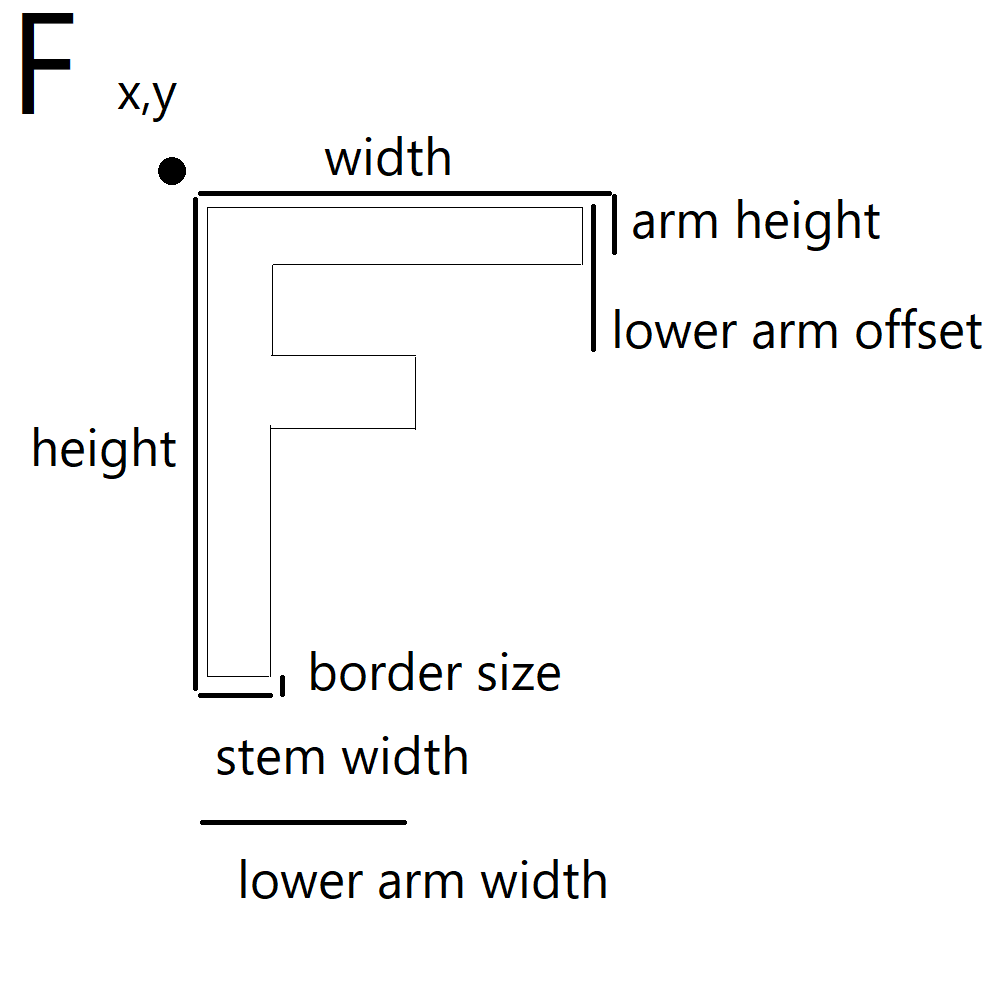
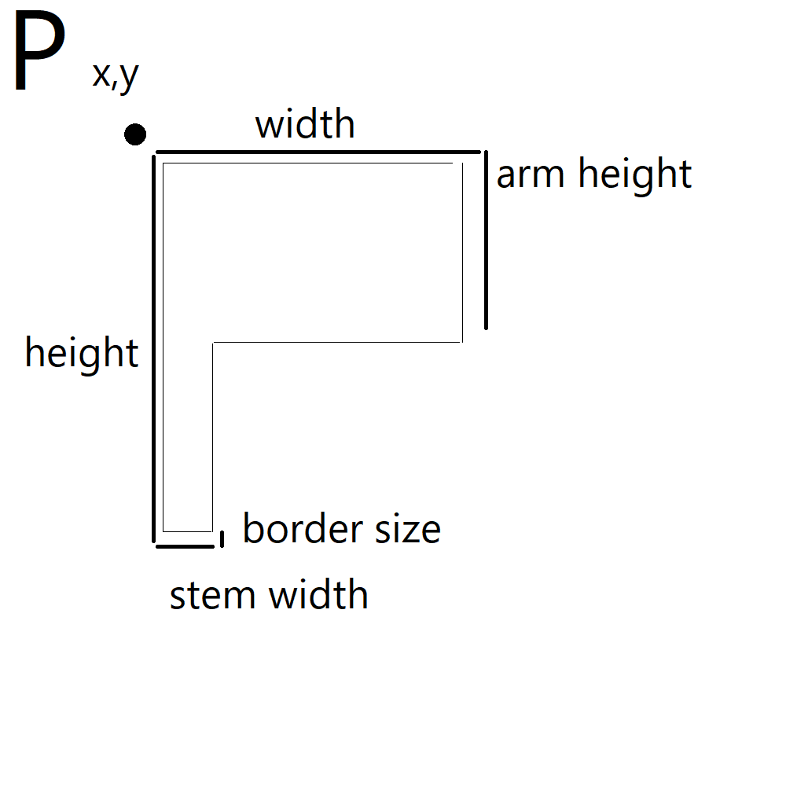

# notes

Baselines

- P should be behind F

horizontal

- F base stem level with P base stem
- F lower arm bottom aligns with base line of P arm

vertical

- F top arm end should align with the second stem line of P